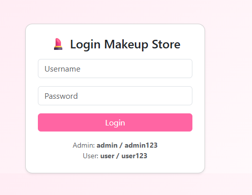
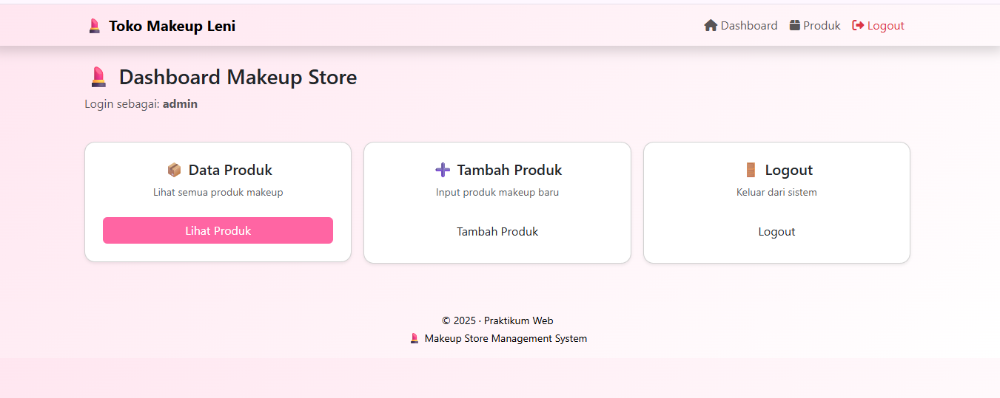
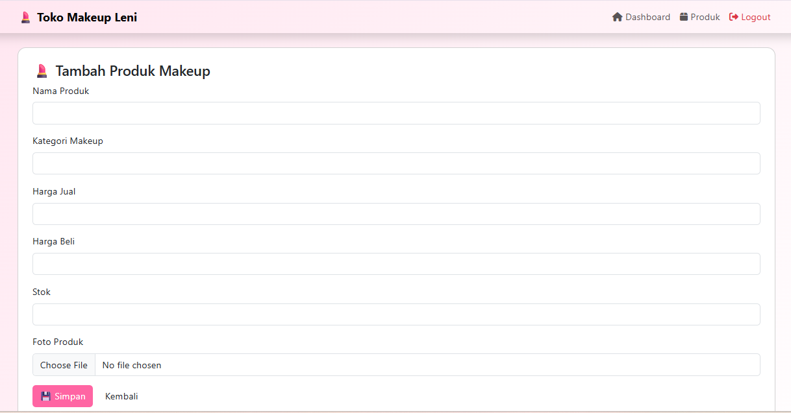
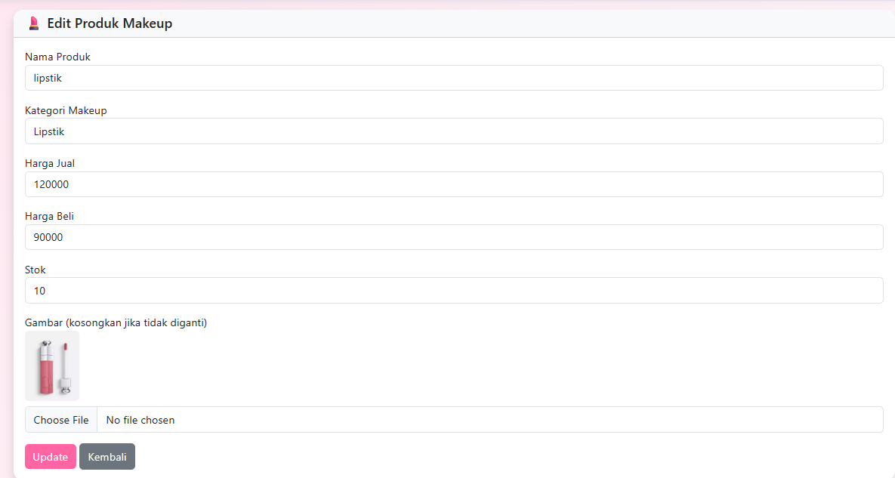
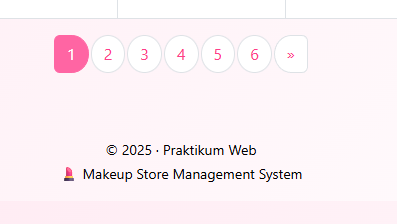
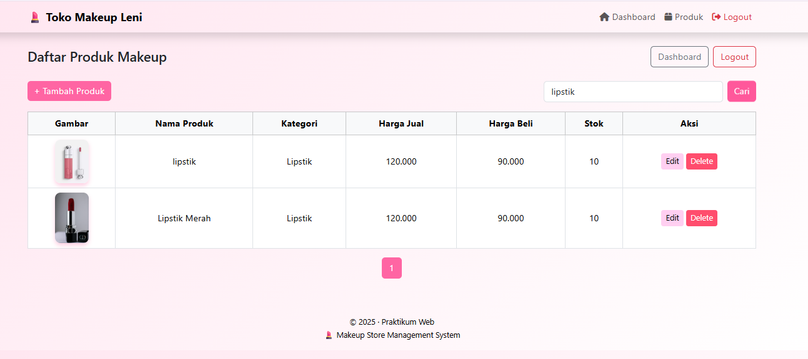
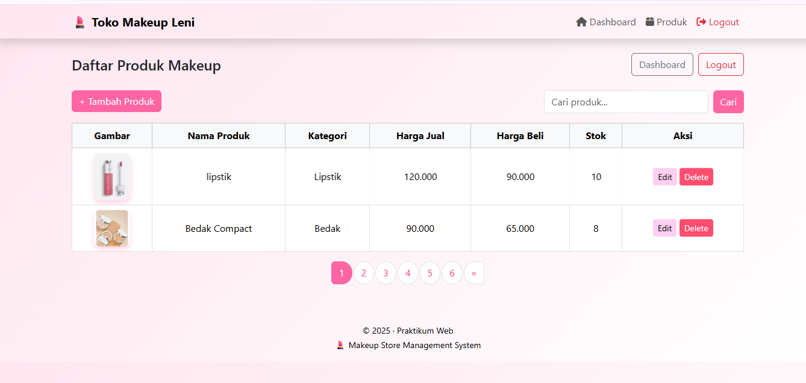
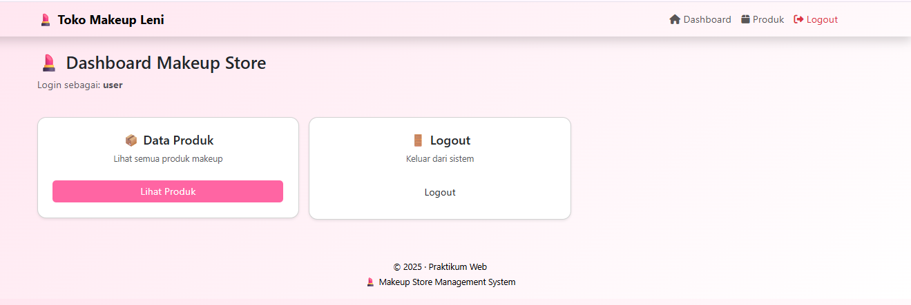
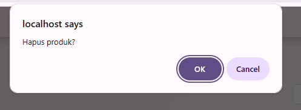

# 🌐 UAS PEMROGRAMAN WEB

🏫 **Universitas Pelita Bangsa**

💐 **Nama:** Leni

🆔 **NIM:** 312410442

💻 **Kelas:** TI.24.A5

👨‍💻 **Mata Kuliah:** Pemrograman Web

📅 **Dosen Pengampu:** Agung Nugroho, S.Kom., M.Kom

 ## 📂 **Struktur Folder Project**

```
PROJECT_UAS/
│
├─ assets/
│   └─ style.css          <-- CSS global
│
├─ config/
│   └─ database.php       <-- koneksi DB
│
├─ data/
│   ├─ add.php
│   ├─ barang.php
│   ├─ delete.php
│   └─ edit.php           <-- CRUD untuk barang
│
├─ images/ & img/         <-- folder gambar
│
├─ layout/
│   ├─ footer.php
│   └─ header.php          <-- template halaman
│
├─ modules/auth/
│   ├─ login.php
│   └─ logout.php           <-- modul autentikasi
│
├─ .htaccess
├─ dashboard.php
└─ index.php

```

## 📄 **Deskripsi Singkat Project**
Aplikasi ini merupakan sistem manajemen data barang berdasarkan project praktikum OOP dan Modular menggunakan Routing App (gunakan .htaccess) dan dilengkapi dengan fitur pagination, pencarian, dan CRUD (Create, Read, Update, Delete). Aplikasi ini menggunakan PHP dan MySQL untuk mengelola data barang beserta gambar produknya.


## Penjelasan Fungsi File
- `config/database.php`: File ini berisi konfigurasi untuk menghubungkan aplikasi dengan database MySQL.
- `data/barang.php`: Menampilkan daftar barang dengan opsi pagination.
- `data/add.php`: Form untuk menambahkan data barang baru.
- `data/delete.php`: Proses untuk menghapus data barang dari database.
- `data/edit.php`: Proses untuk mengedit data barang dari database.
- `layout/header.php`: Bagian header halaman yang memuat CSS dan navbar.
- `layout/footer.php`: Bagian footer halaman yang menutup tag HTML dan memuat JS.
- `images/`: Folder untuk menyimpan gambar barang yang diupload.
- `modules/auth/login.php`: Digunakan untuk proses masuk (login) pengguna ke sistem.
- `modules/auth/logout.php`: Digunakan untuk proses keluar (logout) pengguna dari sistem.
- `dashboard.php`:halaman utama setelah login yang berfungsi sebagai pusat kontrol atau ringkasan informasi untuk pengguna.
- `index.php`:Halaman utama dari aplikasi/web. Bisa diakses langsung dari browser tanpa harus masuk ke modul lain.
- `assets/style.css`: File CSS custom tema pastel / netral untuk styling aplikasi.


## 🚀 **Fitur Utama**
- **Pagination:** Menampilkan data barang dalam halaman yang terpisah untuk memudahkan navigasi.
- **CRUD:** Menambahkan, mengedit, menghapus, dan menampilkan data barang.
- **Upload Gambar:** Setiap barang dapat memiliki gambar yang diupload dan ditampilkan.
- **Pencarian:** Memudahkan pencarian barang berdasarkan nama atau kategori.
- **Modular**: Buat file/fungsi terpisah misal modules/pagination/Pagination.php
- **OOP**: Buat class Pagination


## Kode Utama: 

Contoh kode koneksi database (`config/database.php`):

```php
<?php
$host = "localhost";
$user = "root";
$pass = "";
$db   = "uas_makeup";

$conn = mysqli_connect($host, $user, $pass, $db);

if (!$conn) {
    die("Koneksi database gagal: " . mysqli_connect_error());
}
```


## 🛠️ **Teknologi yang Digunakan**

- PHP → logika server & OOP

- MySQL → database untuk menyimpan data

- HTML / CSS → struktur & tampilan halaman web

- Bootstrap → styling dan layout responsif

- PDO / MySQLi → koneksi database aman dengan prepared statements

- Session Management → untuk login/logout dan keamanan user

- File Upload Handling → untuk upload gambar barang

- Pagination & Search → menampilkan data rapi dan memudahkan pencarian


## Screenshot Implementasi

1. halaman utama dengan pagination





2. form tambah barang


3. halaman edit barang


4. tampilan pagination


5. tampilan pencarian data


6.  tampilan produk


7. tampilan saat user login


8. tampilan saat user melihat barang


9. tampilan hapus barang (admin)



## 📥 Cara Instalasi

1. **Persyaratan Sistem**
   - XAMPP (PHP 7.4 atau lebih tinggi)
   - MySQL
   - Web Browser (Chrome, Firefox, dll.)

2. **Langkah Instalasi**
   - Download dan instal XAMPP.
   - Jalankan Apache dan MySQL di XAMPP.
   - Buat database baru bernama `uas_makeup`.
   - Import file SQL `uas_makeup.sql` ke dalam database.
   - Copy folder project ke dalam direktori `htdocs` di XAMPP.
   - Buka browser dan akses `http://localhost/project_uas/modules/auth/login.php`.

## 🔐 Akun Demo

Admin:
- Username: admin
- Password: admin123

User:
- Username: user
- Password: user123

## 🎥 Video Dokumentasi

Link Video Demo Aplikasi:
(Link akan ditambahkan)


